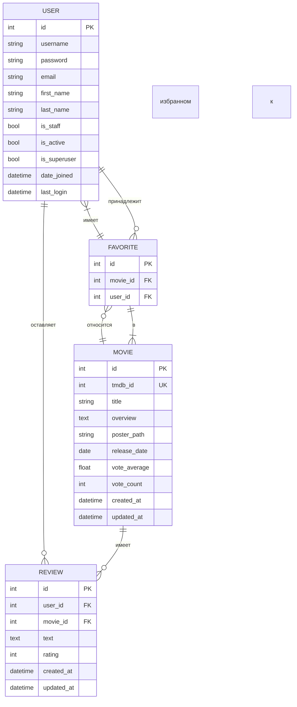

# Диаграмма базы данных TMDB-Net (SVG)

Ниже представлена диаграмма базы данных в формате Mermaid, который можно преобразовать в SVG с помощью различных онлайн-инструментов или плагинов для IDE.

## Как использовать эту диаграмму

1. **GitHub**: При загрузке этого файла в репозиторий GitHub, диаграмма будет автоматически отрендерена.

2. **Visual Studio Code**: 
   - Установите расширение "Mermaid Preview" или "Markdown Preview Mermaid Support"
   - Откройте этот файл и используйте предпросмотр Markdown

3. **Онлайн-редакторы**:
   - Вставьте код диаграммы на сайт [Mermaid Live Editor](https://mermaid.live/)
   - Экспортируйте результат в SVG или PNG

4. **Инструменты командной строки**:
   - Установите `mermaid-cli` через npm
   - Преобразуйте диаграмму в SVG с помощью команды `mmdc -i database_schema_svg.md -o database_schema.svg`

## Преимущества использования Mermaid

- Представление в виде кода (легко редактировать и поддерживать)
- Интеграция с системами контроля версий
- Возможность экспорта в различные форматы
- Поддержка в популярных средах разработки и документации 