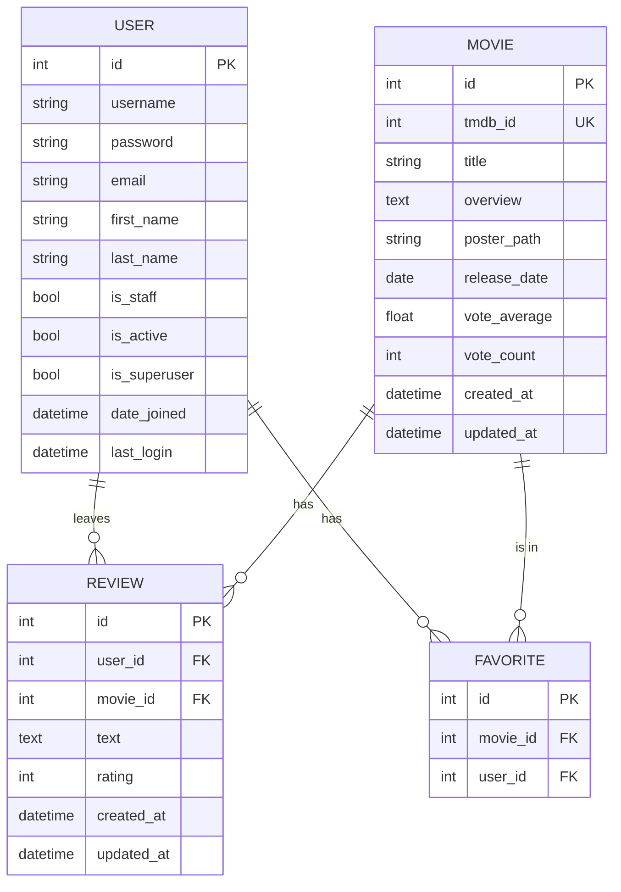

# Схема базы данных TMDB-Net

## Описание таблиц

### User (пользователи) - Стандартная модель Django

Таблица `auth_user` (стандартная модель Django):
- `id` (PK) - Уникальный идентификатор
- `username` - Имя пользователя
- `password` - Хеш пароля
- `email` - Электронная почта
- `first_name` - Имя
- `last_name` - Фамилия
- `is_staff` - Флаг доступа к админке
- `is_active` - Активный пользователь
- `is_superuser` - Флаг суперпользователя
- `date_joined` - Дата регистрации
- `last_login` - Последний вход

### Movie (фильмы)

Таблица `movies_movie`:
- `id` (PK) - Уникальный идентификатор фильма в нашей базе
- `tmdb_id` (Unique) - Уникальный идентификатор фильма в TMDB API
- `title` - Название фильма
- `overview` - Описание фильма (может быть пустым)
- `poster_path` - Путь к постеру фильма (может быть пустым)
- `release_date` - Дата выхода фильма (может быть пустой)
- `vote_average` - Средняя оценка фильма (по умолчанию 0)
- `vote_count` - Количество голосов (по умолчанию 0)
- `created_at` - Дата создания записи в нашей базе
- `updated_at` - Дата последнего обновления записи

### Review (отзывы)

Таблица `movies_review`:
- `id` (PK) - Уникальный идентификатор отзыва
- `user_id` (FK) - Внешний ключ к таблице пользователей
- `movie_id` (FK) - Внешний ключ к таблице фильмов
- `text` - Текст отзыва
- `rating` - Оценка фильма (от 1 до 10)
- `created_at` - Дата создания отзыва
- `updated_at` - Дата последнего обновления отзыва

Уникальное ограничение: `(user_id, movie_id)` - один пользователь может оставить только один отзыв к фильму

### Favorite Movies (избранные фильмы) - Таблица связи Many-to-Many

Таблица `movies_movie_favorited_by` (автоматически создана Django):
- `id` (PK) - Уникальный идентификатор связи
- `movie_id` (FK) - Внешний ключ к таблице фильмов
- `user_id` (FK) - Внешний ключ к таблице пользователей

Уникальное ограничение: `(movie_id, user_id)` - фильм может быть добавлен в избранное только один раз

## ER-диаграмма

## Связи между таблицами

1. **Пользователь и Отзывы** (User → Review):
   - Связь: One-to-Many
   - Описание: Один пользователь может оставить множество отзывов, каждый отзыв принадлежит только одному пользователю
   - Ограничение: CASCADE DELETE (при удалении пользователя удаляются все его отзывы)

2. **Фильм и Отзывы** (Movie → Review):
   - Связь: One-to-Many
   - Описание: Один фильм может иметь множество отзывов, каждый отзыв относится только к одному фильму
   - Ограничение: CASCADE DELETE (при удалении фильма удаляются все отзывы к нему)

3. **Пользователь и Избранные фильмы** (User ↔ Movie):
   - Связь: Many-to-Many через таблицу FAVORITE
   - Описание: Один пользователь может добавить в избранное множество фильмов, один фильм может быть в избранном у множества пользователей

## Индексы

1. `movies_movie.tmdb_id` - уникальный индекс для быстрого поиска фильмов по TMDB ID
2. `movies_review(user_id, movie_id)` - уникальный составной индекс для обеспечения ограничения "один отзыв на фильм от пользователя"
3. `movies_movie.created_at` - индекс для сортировки фильмов по дате добавления
4. `movies_review.created_at` - индекс для сортировки отзывов по дате создания

## Дополнительная информация

Эта схема базы данных реализует основные функции веб-приложения для работы с TMDB API:
- Хранение информации о фильмах из TMDB
- Управление пользователями и их аутентификацией
- Добавление фильмов в избранное
- Создание и просмотр отзывов на фильмы

База данных спроектирована с учетом следующих принципов:
- Нормализация данных для минимизации избыточности
- Правильные ограничения для обеспечения целостности данных
- Эффективные связи между таблицами
- Индексы для оптимизации запросов 